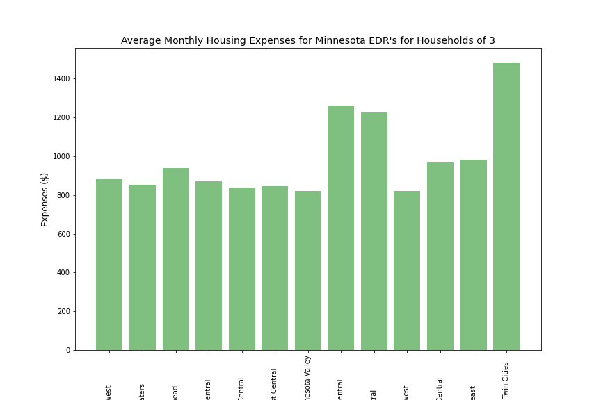

# Project-1-Team-5

# Proposal
Our project is to determine if it is more lucrative to live in the Twin Cities Metro area or Greater Minnesota based on the ration of wages to cost of living. We'll look at trends in housing and wage data over time; income to expense ratios for each economic development region (EDR) of Minnesota; and compare our finidings for Minnesota to Ohio to see if another state produces similar results.

# Comparitive Analysis
Is it more lucrative to live in the Twin Cities Metro area or Greater Minnesota?

  * Twin Cities Metro Area vs Greater Minnesota
  * Comparison vs Ohio's Greater & Metro Areas

### Questions:
 * What is the average income to expenses ratio for each economic development regions of Minnesota and how do they compare to each other? 
 * How does the change in average income compare with the change in housing prices in these areas over time? 
 * Does the data we find for Minnesota hold true for Ohio? 

# Data Sources
- Minnesota Cost of Living (CSV) from the Minnesota Department of Economic Development (DEED) https://mn.gov/deed/data/data-tools/col/ - Used for determining cost of living expenses
- Minnesota Quarterly Census of Employment Wages (CSV) from the Minnesota Department of Economic Development (DEED) https://mn.gov/deed/data/data-tools/qcew/ - Used for wage data
- US Census Bureau (API) https://www.census.gov/ - Used for population data and wage data for Ohio
- Federal Housing Finance Agency (API) (FHFA) https://www.fhfa.gov/DataTools/Downloads/Pages/House-Price-Index-Datasets.aspx#qat - Used for housing price data
- Council for Community and Economic Research (C2ER) - Used through Rent Cafe to find cost of living data for Ohio
- Rent Cafe Cost of Living Calculator (Website) https://www.rentcafe.com/cost-of-living-calculator/us/mn/ https://www.rentcafe.com/cost-of-living-calculator/us/oh/ - Used for finding out cost of living expenses for Ohio
- Federal Reserve Bank of Minneapolis (Website) https://www.minneapolisfed.org/about-us/monetary-policy/inflation-calculator/consumer-price-index-1913- - Used for finding increase in wages in Minnesota over time (based on data from Bureau of Labor Statistics)

# Our Project
 * Determine project idea. What is our main question, with follow-up topics. Initial topic questions were formed to help answer our main question.
 * Determine our data sources, and worked to narrow our scope down.
 * Use Python to extrapolate the data.
 * Use Pandas to clean and format the data.
 * Created Jupyter Notebooks to describe the data exploration and cleanup process.
 * Created a Jupyter Notebook illustrating the final data analysis.
 * Use Matplotlib to create charts.
 * Used an API, to pull data.
 * Create a write-up summarizing our major findings.
 
### Additional Data and Limitations

While working on the data loading and initial cleanup, we discovered that there were additional pieces of data needed that we did not have access to within budget. In order to get the appropriate data necessary, we utilitize the following techniques:

1) Using the original information we had pulled for Ohio, we did not have cost of living information for Ohio. We had pulled Minnesota's data from DEED, but Ohio does not have the same datasets on their government websites. Instead, we used the Rent Cafe Cost of Living Index (which is based on the C2ER Cost of Living Index) to find how Ohio and Minnesota each compared to the national average, and from there, we were able to perform calculations to find Ohio's cost of living amounts. Due to this, the data is not exact, but the percentage is the same.

2) Similarly to the problems we discovered with Ohio, we did not have data over time for Minnesota's cost of living, as DEED only had information available for 2021. In order to calculate this change, we used data acquired from the Federal Reserve Bank of Minneapolis website (which uses data from the Bureau of Labor Statistics) to find the price changes for cost of living over time. Due to this, the data is not exact, but the percentage is the same.

3) When calculating cost of living, the C2ER Cost of Living Index, which is the gold-standard for cost of living comparisons, uses 6 factors: Housing, Utilities, Food, Healthcare, Transportation, and Goods & Services. DEED does not use Utilities in their calculations. Instead, they include childcare and additional other factors. In order to make the data as comparable as possible, we only used the five common factors of housing, food, healthcare, transportation, and other (representing goods & services), meaning that the data could actually be slightly different than if it actually included the full suite of factors.

## Analysis
According to DEED, as well as our own checking on this matter, the average household size for the state of Minnesota is three (3). We will use this number going forward when discussing household totals, and we will also assume that each household has two working adults. There is one piece of comparison we use where only one working adult is considered.

Using our information from DEED, we were able to find that, on average, a single working person cannot afford the expenses of a three-person household by themselves. A single worker’s wages will only cover roughly 80% of the total expenses of an average household, and that percentage only differs by up to 2% between the regions. In a two-worker household, this ratio fairs much better, as income will cover roughly 63% of expenses in this case.

Shockingly, the economic development regions are very comparable. Central (7W) has the best income to expense ratio, followed closely by the Twin Cities region (11), while Southwest Central (6E) showed the worst ratio. However, since these ratios only differ by up to 2%, there is not a significant difference. Regardless of where you lived in Minnesota in 2021, your income to expense ratio was roughly the same as the rest of the state.

Over time, we are able to see that between 2011 and 2021, average household expenses increased 18.8% in total, while average wages increased by 50.58%. Housing price increases has been a point of concern in the US since the COVID-19 pandemic started, so we decided to look at the difference in housing prices between 2011 and 2021 to see if the changes in housing costs were different between the Twin Cities metro area and the rest of the state. We were able to find housing prices have skyrocketed since 2011 in both the Twin Cities region and Greater Minnesota. However, while Greater Minnesota had a 55.55% increase in HPI, the Twin Cities region had a 74% increase. Based on this information, we are able to conclude that there is no significant difference in where you live in Minnesota. There is only about a 2% difference between each EDR in terms of income to expense ratio, and that is already including the changes in housing prices.

### How does this compare to Ohio?
Based on Cost of Living Index data, we are able to see that Minnesota’s cost of living expenses are about 1% lower than the national average, whereas Ohio’s expenses are about 9% lower. The largest of these differences is in housing, in which Ohio is 23% better than the national average versus only 11% better for Minnesota. Ohio’s expenses were lower than the national average across the board. The median household income for Minnesota is about 25% higher than Ohio, and the median housing value for Minnesota is 58% higher than Ohio. Ohio has a much higher population than Minnesota (51.56% difference), and the total wages for both states show a 52.8% difference, which is on par with the population difference. With the lower expenses and the similar wages to Minnesota, Ohio would be a less costly state to live than Minnesota.

# Conclusion

In conclusion, the economic development regions of Minnesota are very comparable to each other. With the only major difference between the Twin Cities region and the rest of the state being the rate at which housing prices are increasing, this data does not necessarily prove living in the Twin Cities region is better or worse than living in another part of Minnesota. One would need to continue research into other factors to determine any greater difference, such as occupations, recreation, and general availability of certain goods and services.
